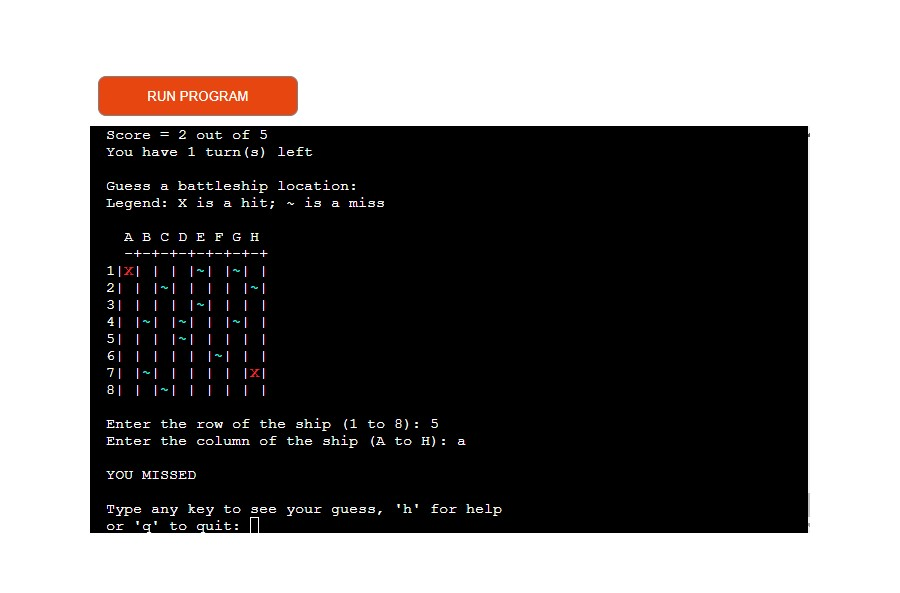
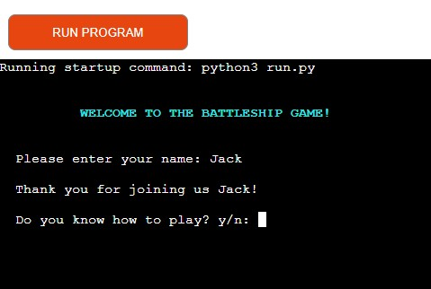
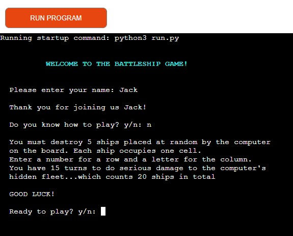
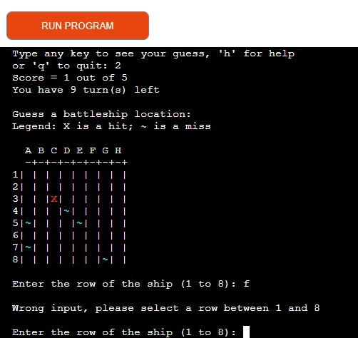
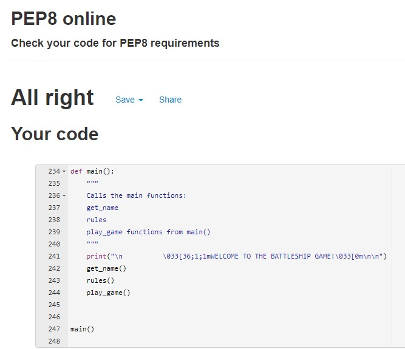

<h1 text-align="center">BATTLESHIP</h1>

Click on [A Battleship Game](https://a-battleship-game.herokuapp.com/) to access the live project.

# THE GAME: OVERVIEW
Originally, the Battleship game started off as a pencil and paper two player guessing game, until it was 
released as a board game in 1967. Players hide their ships on separate grids, then alternate shots at  
the opposing player, trying to find and seek their fleet. 

My Battleship game is written purely in Python and designed to run on the Code Institute mock terminal  
on Heroku. It is a one player game, against the computer. 20 battleships are placed at random by the computer 
on a hidden board. Each ship occupies one cell. The grid has 64 cells (8 x 8). The player fires shots by  
inputting a row number and a column letter. He's entitled to 20 guesses but only needs to find 5 ships to win the game. 

# EXPERIENCE (UX)
The target audience: 
   - Children (this game is very easy to play)
   - Gamers in general
   - People who loved the board game in the 70's and 80's
   - People who enjoyed the first terminal games

## User Stories
1. First Time Visitor Goals
   - I want the rules to be easy to grasp
   - I want to know my score against the computer

2. Returning Visitor Goals
   - I want to play again to improve my score
    
3. Frequent User Goals
   - I want to see if there is any added features

## Flowchart

 

# FEATURES
## Welcome! Enter name
   - 'Welcome' message, the player enters his/her name
         - No input: "not an appropriate name" is displayed
         - The name is only used once, for the thank you message
   - If player answers anything but "n" to the next question, the game starts
   - Player selects "n" to 'do you know how to play?': Rules are displayed 

## Rules
   - Player not interested in the game: they can quit
   - Otherwise, player starts the game

## Play the game
The player only sees one grid (the 'guess' board). He enters a number for a row and a letter for a column of 
his choice. If it's a miss, 'O' is displayed; a win: X. 
If the same coordinates are entered twice, "You guessed that one already" is displayed.
Wrong input: The player will get a message until the input is correct (see image below)
A  blue '~': "YOU MISSED" is displayed on the board
A red 'X': "BATTLESHIP SUNK!" is displayed on the board

During the game, the player also sees the following:
   - His score out of 5
   - Number of turns left out of 20

After each turn, the player has the option to leave the game by pressing 'q' or to get a reminder of the rules by pressing 'h'.

## End of game
The game is over when the player sinks 5 battleships or when he/she's out of turns. 
The 'hidden_board', with the 20 ships placed are random, are displayed: the player can compare with his own board! 
The player can start a new game by pressing 's'.

## Future Features
The player could place his own ships; the 5 ships could have different sizes. 
The number of ships and turns could be increased, the size of the board too. 

 
# TECHNOLOGIES USED
## Languages
- PYTHON

## Cloud Platform for apps
- HEROKU

## Frameworks
<ul>
      <li>Git: Used for version control: using Gitpod terminal to commit to Git  and Push to GitHub</li>
      <li>GitHub: Used to store the projects code after being pushed from Git</li>
      <li>Heroku: Used to run in the Code Institute mock terminal</li>
</ul>

## Programmes and tools
- PEP8 to validate the code
- Lucidchart to create the above flowchart

 

# TESTING
- Used 'print' to check the returned data and printed the 'hidden' board
- Tested in terminal and online in Heroku
- Fixed issues as described in 'traceback'
- Tested in PEP8 to validate indentation and line length mostly
- Tested by a third party, with focus on invalid input

## Fixed Buggs
- When I printed the computer_board, the ships didn't show. I fixed it by correcting the indentation in the 'while' loop
- I first put the Rules function at the top and couldn't figure out why the 'sunk' ships didn't show on the player_board. 
   I had to move the function under play_game
- My get_name function didn't work when placed under the 'main' function: return name was missing
- Couldn't find a method for 'empty' string to validate the name input: used a solution found online that seems to work
- Added style to "X" (ship) but forgot to do it in the create_ships function so no ship could be found...
- The try except statement didn't always print a message in get_ship_location: I added a if-else to fix the issue

## Validation
My run.py file was passed through the PEP8 validator successfully. I used the validator on a regular basis throughout 
the project as I find the indentation of long lines of code a bit tricky.

 

# DEPLOYMENT
To deploy project 3, I created an account on the [Heroku website](https://www.heroku.com/)

   - Log in Heroku
   - Click on "New" button in top right corner, select "App"
   - You're in the Heroku dashboard. Enter app name: a-battleship-game ; Enter region: Europe
   - Click on "Create App"
   - Click on the "Settings" tab (important: must be done before "Deploy")
   - "Add buildpack" section: click and select, in this order (you can change the order by dragging if necessary):
      - 1) Heroku/python
      - 2) Heroku/nodejs
   - "Config Vars" section: 
      - 1) Config PORT (key) 8000 (value) 
      - 2) Config CREDS (Key) and copy-paste content of the package.json file from your vs code folder
   - Click on the "Deploy" tab
   - Method: select GitHub (it should say, 'connected') and connect to your repository by clicking on Search
   - You're connected to your repository: scroll down the page and chose to click on Enable Automatic
   - When done, "Your app was successfully deployed" appears. Click on the View button to see the app

 

# CREDITS
## Code:
I followed some free tutorials found online to help me build the game with Python. I used some code from the Code Institute  
runnable exercices and challenges. I also found some useful code on GitHub:

   - [How to code Battleship in Python - Single player game](https://www.youtube.com/watch?v=tF1WRCrd_HQ)
   - [Coding Advanced Battleship Part I in Python](https://www.youtube.com/watch?v=xz9GrOwQ_5E)
   - https://github.com/dmoisset/battleship-dojo

## Acknowledgements to: 
- My cohort classmates for sharing useful information every day and useful info on the Code Institute Slack Channels
- The developers who post helpful videos on games tutorials for beginners in JavaScript on YouTube