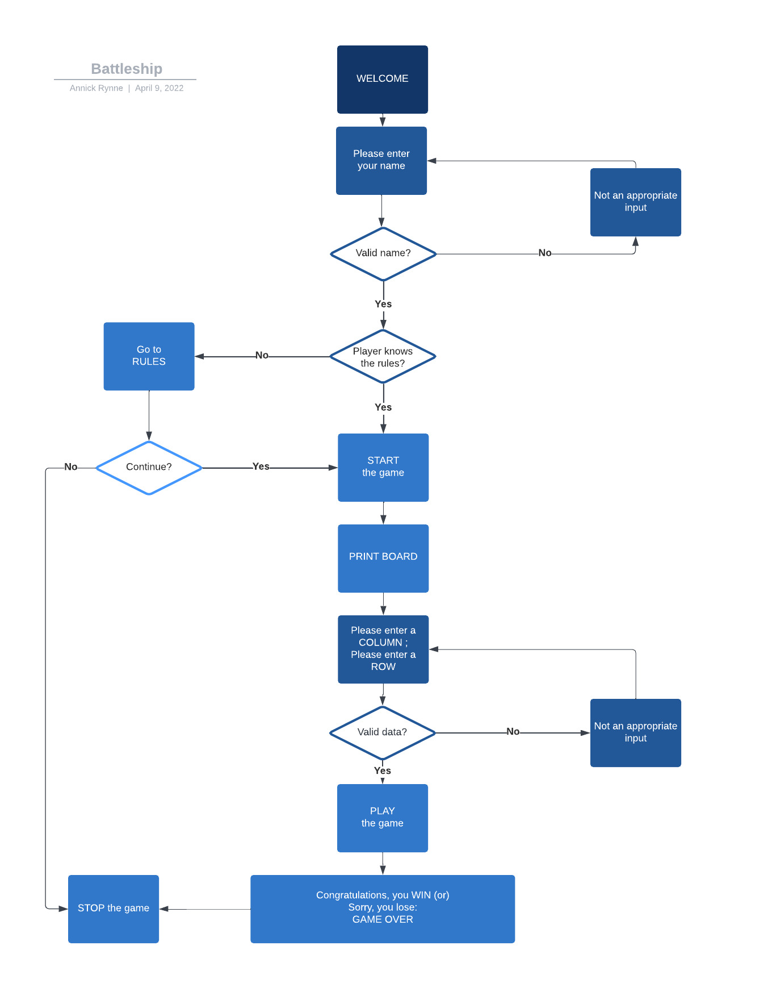

<h1 text-align="center">BATTLESHIP</h1>

Click on [A Battleship Game](https://a-battleship-game.herokuapp.com/) to access the live project.

# INTRODUCTION
Battleship is game written purely in Python and designed to run on the Code Institute mock terminal on Heroku.

 

# EXPERIENCE (UX)
The target audience: Playing on a Python terminal will attract an audience who is nostalgic of the first games that they used to play with in the seventies. But it's likely that a younger generation of 'gamers' will find the it interesting too. Terminal based games seem to be becoming popular again.

## User Stories
1. First Time Visitor Goals
   - I want the rules to be easy to grasp
   - I want to know my score against the computer

2. Returning Visitor Goals
   - I want to play again to improve my score
    
3. Frequent User Goals
   - I want to see if there is any added features

## Flowchart

 

# FEATURES
## Welcome! Enter name

After a 'Welcome' message, the player must enter his/her name to continue. 
No input: "not an appropriate name" is displayed
Correct input: we move to the Rules

## Rules

Many people know this game, therefore I give them the option to skip the rules by asking if they know how to play. 
If they accept to read the rules but find that they're not interested in the game, they can quit. If they chose to continue, we move to the Game.

## Play the game

The player only sees one grid (the 'guess' board). He enters a number for a row and a letter for a column of his choice. If it's a miss, 'O' is displayed; a win: X. 
If the same coordinates are entered twice, "You guessed that one already" is displayed.
A 'O': "MISSED" is displayed
A 'X': "BATTLESHIP HIT!" is displayed

During the game, the player also sees the following:
   - His score out of 5
   - Number of turns left out of 10

## Future Features

The player could place his own ships; the 5 ships could have different sizes. The number of ships and turns could be increased, the size of the board too.

## Data Model

I used functions for all the different stages of the game. 
The functions are called in a main function.
 

# TECHNOLOGIES USED
## Languages
- PYTHON

## Cloud Platform for apps
- HEROKU

## Frameworks
<ul>
      <li>Git: Used for version control: using Gitpod terminal to commit to Git  and Push to GitHub</li>
      <li>GitHub: Used to store the projects code after being pushed from Git</li>
      <li>Heroku: Used to run in the Code Institute mock terminal</li>
</ul>

## Programmes and tools
- PEP8 to validate the code
- Lucidchart to create the above flowchart

 

# TESTING
- I tested my code in pep8 on numerous occasions
- I used 'print' to check the returned data and printed the 'hidden' board
- I fixed the issues as described in my local terminal
- I ran the game app in Heroku once deployeds

<!--  -->

## Fixed Buggs
- When I printed the computer_board, the ships didn't show. I fixed it by correcting the indentation in the 'while' loop
- I first put the Rules function at the top and couldn't figure out why the 'sunk' ships didn't show on the player_board. I had to move the function under play_game
- My get_name function didn't work when placed under the 'main' function: return name was missing
- Couldn't find a method for 'empty' string to validate the name input: used a solution found online that seems to work

## Remaining Buggs

 

# DEPLOYMENT
To deploy project 3, I created an account on the [Heroku website](https://www.heroku.com/)
<ul>
   <li>Log in Heroku</li>
   <li>Click on "New" button in top right corner, select "App"</li>
   <li>You're in the Heroku dashboard. Enter app name: a-battleship-game ; Enter region: Europe</li>
   <li>Click on "Create App"</li>
   <li>Click on the "Settings" tab (important: must be done before "Deploy")</li>
   <li>"Add buildpack" section: click and select, in this order (you can change the order by dragging if necessary): 1) Heroku/python 2) Heroku/nodejs</li>
   <li>"Config Vars" section: 1) Config PORT (key) 8000 (value) 2) Config CREDS (Key) and copy-paste content of the package.json file from your vs code folder</li>
   <li>Click on the "Deploy" tab</li>
   <li>Method: select GitHub (it should say, 'connected') and connect to your repository by clicking on Search</li>
   <li>You're connected to your repository: scroll down the page and chose to click on Enable Automatic Deploy or (manual) Deploy Branch to see the deployment</li>
   <li>When done, "Your app was successfully deployed" appears. Click on the View button to see the app </li>
</ul>
 

# CREDITS
## Code:
I followed some free tutorials found online to help me build the game with Python. I used some code from the Code Institute runnable exercices and challenges. I also found some useful code on GitHub:

   - [How to code Battleship in Python - Single player game](https://www.youtube.com/watch?v=tF1WRCrd_HQ)
   - [Coding Advanced Battleship Part I in Python](https://www.youtube.com/watch?v=xz9GrOwQ_5E)
   - https://github.com/dmoisset/battleship-dojo

## Acknowledgements to: 
- My cohort classmates for sharing useful information every day and useful info on the Code Institute Slack Channels
- The developers who post helpful videos on games tutorials for beginners in JavaScript on YouTube